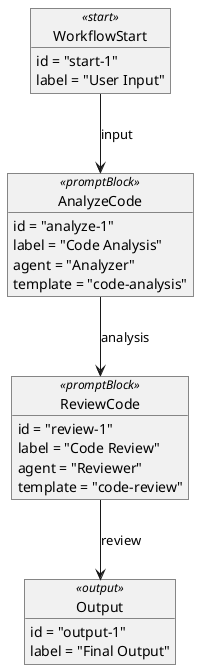
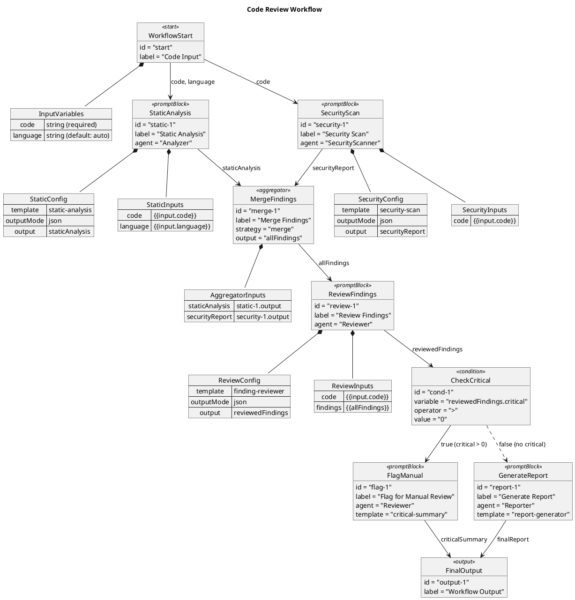

# PlantUML Workflow Schema Specification

This document describes a schema for defining agent workflows using PlantUML activity diagrams. The schema extends standard PlantUML syntax with annotations to capture prompt templates, agent assignments, variable bindings, and control flow.

## Overview

PlantUML activity diagrams provide a visual way to define workflows. By adding structured annotations, we can convert these diagrams into executable workflow configurations that integrate with the agent orchestration system.

## Basic Structure

A workflow diagram uses PlantUML's activity diagram syntax with custom annotations in notes:


## Swimlanes as Agent Assignment

Swimlanes map directly to agent assignments. Each swimlane represents a different agent that will execute the steps within it.

```plantuml
|#LightBlue|Researcher|
|#LightGreen|Writer|
|#LightCoral|Reviewer|
```

### Swimlane Properties

| Property | Description |
|----------|-------------|
| Color | Visual identifier (optional) |
| Name | Agent role or identifier |

### Agent Resolution

When the workflow executes, swimlane names resolve to agents in one of these ways:

1. **By Role**: Match against `agent.role` field
2. **By ID**: Direct instance ID reference (e.g., `Agent_abc123`)
3. **By Capability**: Match agents with required capabilities

## Activity Annotations

Each activity (`:Activity Name;`) can have an associated note with structured metadata.

### Prompt Block Annotation

```plantuml
:Analyze Code;
note right
  <<prompt>>
  template: code-analysis
  input: {{code}}
  output: analysis
  outputMode: json
  outputSchema: {"issues": [], "suggestions": []}
end note
```

### Annotation Fields

| Field | Required | Description |
|-------|----------|-------------|
| `template` | Yes | Prompt template ID or inline template |
| `input` | Yes | Input variable(s) using `{{variable}}` or `$VARIABLE` syntax |
| `output` | Yes | Output variable name for downstream reference |
| `outputMode` | No | Output extraction mode: `full`, `json`, `jsonpath`, `regex`, `first_line` |
| `outputSchema` | No | Expected JSON schema for validation |
| `retries` | No | Number of retry attempts on failure (default: 2) |
| `timeout` | No | Timeout in seconds (default: 120) |

### Inline Templates

For simple prompts, you can define the template inline:

```plantuml
:Quick Check;
note right
  <<prompt>>
  template: |
    Review this code for obvious issues:
    {{code}}

    Respond with: OK or list issues.
  input: {{code}}
  output: quickCheck
end note
```

## Control Flow

### Sequential Flow

Activities in sequence execute one after another:

```plantuml
:Step 1;
:Step 2;
:Step 3;
```

### Conditional Branching

Use PlantUML's `if/then/else` for condition nodes:

```plantuml
:Evaluate Quality;
note right
  <<prompt>>
  template: quality-check
  input: {{content}}
  output: quality
  outputMode: json
end note

if (quality.score > 0.8?) then (yes)
  :Publish;
else (no)
  :Revise;
  note right
    <<prompt>>
    template: revision-prompt
    input: {{content}}, {{quality.feedback}}
    output: revisedContent
  end note
endif
```

### Condition Node Mapping

| PlantUML | Workflow Node |
|----------|---------------|
| `if (condition?) then (yes)` | `ConditionNode` with true branch |
| `else (no)` | `ConditionNode` false branch |
| `elseif (condition?)` | Chained `ConditionNode` |

### Supported Condition Operators

```plantuml
if ($result == "success"?) then (true)
if ($score > 80?) then (pass)
if ($status != "error"?) then (continue)
if ($text contains "approved"?) then (approved)
if ($pattern matches "^OK.*"?) then (match)
```

### Loops with Evaluation

For iterative refinement patterns:

```plantuml
repeat
  :Generate Content;
  note right
    <<prompt>>
    template: content-generator
    input: {{topic}}, {{feedback}}
    output: content
  end note

  :Evaluate;
  note right
    <<prompt>>
    template: content-evaluator
    input: {{content}}
    output: evaluation
    outputMode: json
  end note

repeat while (evaluation.pass == false?) is (retry)
->done;
```

This maps to an `EvaluatorNode` with loop-back edges.

## Router Nodes

For classification-based routing to multiple agents:

```plantuml
:Classify Request;
note right
  <<router>>
  template: request-classifier
  input: {{request}}
  routes:
    - category: "technical"
      target: TechSupport
    - category: "billing"
      target: BillingAgent
    - category: "general"
      target: GeneralSupport
end note

split
  |TechSupport|
  :Handle Technical;
split again
  |BillingAgent|
  :Handle Billing;
split again
  |GeneralSupport|
  :Handle General;
end split
```

## Aggregator Nodes

For combining outputs from parallel branches:

```plantuml
fork
  |Researcher1|
  :Research Topic A;
fork again
  |Researcher2|
  :Research Topic B;
end fork

:Combine Research;
note right
  <<aggregator>>
  strategy: concatenate
  inputs: [topicA, topicB]
  output: combinedResearch
  separator: "\n\n---\n\n"
end note
```

### Aggregation Strategies

| Strategy | Description |
|----------|-------------|
| `concatenate` | Join outputs with separator |
| `merge` | Deep merge JSON objects |
| `array` | Collect into array |
| `first` | Take first successful result |
| `vote` | Majority voting (for classification) |

## Variable Flow

Variables flow through the workflow following edge connections.

### Variable Declaration

```plantuml
start
note right
  <<input>>
  variables:
    - name: userQuery
      type: string
      required: true
    - name: context
      type: string
      default: ""
end note
```

### Variable Scoping

- `{{input}}` - Always refers to workflow start input
- `{{variableName}}` - Resolves to nearest upstream output with that name
- `{{nodeId.outputName}}` - Explicit reference to specific node's output
- `$VARIABLE` - Alternative syntax (equivalent to `{{VARIABLE}}`)

## Complete Example


## Parser Implementation Notes

### Parsing Steps

1. **Extract Metadata**: Parse `@startuml` title and global notes
2. **Identify Swimlanes**: Map `|Name|` declarations to agents
3. **Parse Activities**: Extract `:Activity;` nodes
4. **Parse Annotations**: Process `note` blocks for configuration
5. **Build Graph**: Create nodes and edges from flow structure
6. **Resolve Variables**: Validate variable references and bindings

### Node Type Mapping

| PlantUML Element | Workflow Node Type |
|------------------|-------------------|
| `start` | `workflowStart` |
| `:Activity;` with `<<prompt>>` | `promptBlock` |
| `:Activity;` with `<<router>>` | `router` |
| `:Activity;` with `<<aggregator>>` | `aggregator` |
| `if/else` | `condition` |
| `repeat/while` | `evaluator` |
| `stop` | `output` |
| `fork/end fork` | Parallel edges |

### Edge Generation

```
source_activity -> target_activity
  becomes
Edge { source: sourceNodeId, target: targetNodeId, sourceHandle: 'output', targetHandle: 'input' }
```

For conditional branches:
```
if (condition) then (yes) -> true_branch
  becomes
Edge { source: conditionNodeId, target: trueBranchId, sourceHandle: 'true', targetHandle: 'input' }
```

## Integration with Workflow System

### Conversion Function Signature

```typescript
interface PlantUMLWorkflow {
  title: string;
  nodes: Node[];
  edges: Edge[];
  variables: WorkflowVariable[];
  agents: AgentMapping[];
}

function parsePlantUMLWorkflow(puml: string): PlantUMLWorkflow;
function exportWorkflowToPlantUML(workflow: PlantUMLWorkflow): string;
```

### Bidirectional Support

The schema supports both:
- **Import**: PlantUML -> Workflow JSON
- **Export**: Workflow JSON -> PlantUML

This enables visual editing in PlantUML tools while maintaining compatibility with the workflow execution engine.

## Validation Rules

1. All `{{variable}}` references must have a source (input or upstream output)
2. Swimlane names must be unique
3. All `template` references must exist in the prompt template registry
4. Condition expressions must use supported operators
5. Aggregator inputs must all be defined upstream
6. No circular dependencies (except explicit loops via evaluator)

## Alternative: Object Diagram Schema

While activity diagrams excel at showing flow, **object diagrams** provide a more explicit graph-based representation. This approach uses objects to define nodes and arrows to define edges, with `map` objects for structured configuration.

### Why Object Diagrams?

| Feature | Activity Diagram | Object Diagram |
|---------|------------------|----------------|
| Flow visualization | Excellent | Good |
| Node configuration | Via notes | Native fields |
| Explicit edges | Implicit | Explicit arrows |
| Variable bindings | Annotations | Map objects |
| Graph structure | Derived | Direct |

### Basic Object Diagram Structure



### Node Types with Stereotypes

Use stereotypes (`<<type>>`) to indicate node types:

```plantuml
object MyNode <<promptBlock>> {
  id = "node-1"
  label = "My Prompt Block"
}

object Router <<router>> {
  id = "router-1"
  categories = ["tech", "billing", "general"]
}

object Condition <<condition>> {
  id = "cond-1"
  expression = "$score > 80"
}

object Aggregator <<aggregator>> {
  id = "agg-1"
  strategy = "merge"
}
```

### Map Objects for Configuration

PlantUML `map` objects use `=>` syntax for key-value pairs, ideal for variable bindings and complex configuration:

```plantuml
map PromptConfig {
  template => code-analysis
  outputMode => json
  retries => 2
  timeout => 120
}

map VariableBindings {
  code => {{input}}
  language => "typescript"
  context => {{previousOutput}}
}

map OutputSchema {
  issues => array
  suggestions => array
  score => number
}

object AnalyzeCode <<promptBlock>> {
  id = "analyze-1"
  label = "Analyze Code"
  agent = "Analyzer"
}

AnalyzeCode *-- PromptConfig
AnalyzeCode *-- VariableBindings
AnalyzeCode *-- OutputSchema
```

### Relationship Arrows

Different arrow styles convey meaning:

```plantuml
' Data flow (solid arrow)
NodeA --> NodeB : variableName

' Conditional true branch (solid, labeled)
Condition --> TrueBranch : true

' Conditional false branch (dashed)
Condition ..> FalseBranch : false

' Composition (node owns config)
Node *-- Config

' Aggregation (node references)
Node o-- SharedResource
```

### Arrow Direction Control

Control layout with direction keywords:

```plantuml
Start -down-> Step1
Step1 -down-> Step2
Step2 -right-> Parallel1
Step2 -left-> Parallel2
Parallel1 -down-> Merge
Parallel2 -down-> Merge
```

### Condition Nodes in Object Diagrams

```plantuml
object QualityCheck <<condition>> {
  id = "cond-1"
  variable = "quality.score"
  operator = ">"
  value = "0.8"
}

object Publish <<promptBlock>> {
  id = "publish-1"
  label = "Publish Content"
}

object Revise <<promptBlock>> {
  id = "revise-1"
  label = "Revise Content"
}

QualityCheck --> Publish : true
QualityCheck ..> Revise : false
```

### Router Nodes with Map Routes

```plantuml
object ClassifyRequest <<router>> {
  id = "router-1"
  template = "request-classifier"
}

map Routes {
  technical => TechSupport
  billing => BillingAgent
  general => GeneralSupport
}

ClassifyRequest *-- Routes

object TechSupport <<promptBlock>> {
  id = "tech-1"
  agent = "TechAgent"
}

object BillingAgent <<promptBlock>> {
  id = "billing-1"
  agent = "BillingAgent"
}

object GeneralSupport <<promptBlock>> {
  id = "general-1"
  agent = "GeneralAgent"
}

ClassifyRequest --> TechSupport : technical
ClassifyRequest --> BillingAgent : billing
ClassifyRequest --> GeneralSupport : general
```

### Complete Object Diagram Example



### Object Diagram Parser Mapping

| Object Element | Workflow Property |
|---------------|-------------------|
| `object Name <<type>>` | Node with type |
| `id = "..."` | Node ID |
| `label = "..."` | Display label |
| `agent = "..."` | Agent assignment |
| `template = "..."` | Prompt template reference |
| `map ConfigName` | Configuration object |
| `A --> B : label` | Edge with variable name |
| `A ..> B : label` | Conditional/optional edge |
| `A *-- B` | Composition (config owned by node) |

### When to Use Object Diagrams

**Choose Object Diagrams when:**
- You want explicit, typed node definitions
- Configuration is complex with many fields
- You need clear visualization of the graph structure
- Variable bindings are numerous and need organization
- You're building tooling that parses/generates workflows

**Choose Activity Diagrams when:**
- Flow and sequencing is the primary concern
- You want swimlane-based agent visualization
- The workflow is more procedural than graph-like
- You prefer more compact notation

### Hybrid Approach

You can combine both styles - use activity diagrams for high-level flow visualization and object diagrams for detailed node configuration:

```plantuml
@startuml

' High-level flow (activity style)
start
:Analyze;
:Review;
if (Quality OK?) then (yes)
  :Publish;
else (no)
  :Revise;
endif
stop

' Detailed config (object style) - in separate diagram
' object Analyze <<promptBlock>> { ... }

@enduml
```

## Future Extensions

- **Sub-workflows**: `<<include>>` annotation for workflow composition
- **Error Handling**: `<<onError>>` annotations for failure recovery
- **Timeouts**: Global and per-node timeout configuration
- **Metrics**: `<<metrics>>` annotations for tracking
- **Human-in-the-loop**: `<<approval>>` nodes for manual gates
- **Object Diagram Templates**: Reusable object patterns for common node configurations
